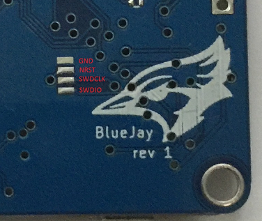

# Board - BlueJayF4

The BlueJayF4 is designed to be a simple STM32F405 based replacement for existing controllers - geared towards race and acro.

## Features 

* 3 hardware serial ports.
* Built-in serial port inverters which allows S.BUS receivers to be used without external inverters.
* USB (can be used at the same time as the serial ports).
* 6 PWM outputs.
* Dedicated PPM/SerialRX input header pins (standard 3 wire male-male servo cable can be used).
* MPU9250 SPI Acc/Gyro/Mag
* MS5611 Barometer
* SPI Flash (2mb Rev1, 8mb rev2 - though we are considering SDCARD)
* Voltage monitoring (built in Voltage divider - **NO** reverse polarity protection on Revision 1 boards)
* Buzzer (Lost drone, and low voltage)

## Features NOT supported by this board

* Sonar
* SoftSerial
* PWM Inputs (Only serial or PPM inputs supported) 
* Airplane PWM mappings -> this board is designed primarily for Racing Quads.

# Flashing

## Via Device Firmware Upload (DFU, USB) - Windows

These instructions are for flashing the BlueJayF4 board under Windows using the RaceFlight Configurator.

Required Software:
* A raceflight-BLUEJAYF4.hex file (for flashing). Should be built from the latest release -> http://github.com/rs2k/raceflight
* Zadig USB driver installation -> http://zadig.akeo.ie/
* RaceFlight Configurator -> http://github.com/rs2k/raceflight-configurator

Flashing steps:

* Place the board into DFU mode by shorting out (soldering or screwdriver) the boot pins on top of the board (revision 1) or pressing and holding the boot button (revision 2) and inserting the USB cable whilst shorted. Only the GREEN power light will come on. Your device will be detected as a STM Device in DFU mode (or STM BOOTLOADER).

* Load up Zadig USB driver and select the STM DFU or STM BOOTLOADER device (if it is not listed please confirm step 1, and / or select "Options / View All Devices" in the Zadig menu. Install the WinUSB driver.

* Ensure Chrome is not running at all (so as to pick up the presence of the new driver) - may require rebooting your machine.

* Start Raceflight Configurator. It should detect a DFU mode device on the Flash Firmware tab.

* Load the local raceflight-BLUEJAYF4.hex file, and then select Flash Firmware.

## Via SWD

On the bottom of the board there are SWD pads available onto which a three wire harness can be soldered onto (four if you include the NRST - though it is not required as for most purposes, IO, CLK and GND are adequate).

Revision 1 boards are simply pads:

Revision 2 boards (not yet produced) will support a JST connector to be attached.

Once you have SWD connected you can use the st-link or j-link tools to flash a binary.

# Virtual Communications Port

The BlueJayF4 utilises the STM32 Virtual Com Port (VCP). This allows the UARTs on board to be utilised whilst the USB is connected. This requires the STM VCP driver to be installed in order for the VCP to be recognised.

The STM32 VCP driver can be downloaded here --> http://www.st.com/web/en/catalog/tools/PF257938

**NOTE:** 
Once you download and run the installation it has **not** installed the driver, merely unpacked the choice of drivers. Locate the installation directory and then run the EXE file pertaining to your system.

e.g. C:\Program Files (x86)\STMicroelectronics\Software\Virtual comport driver\Win8\ <- will have two files present. One for 64 bit systems and one for 32 bit systems. 
